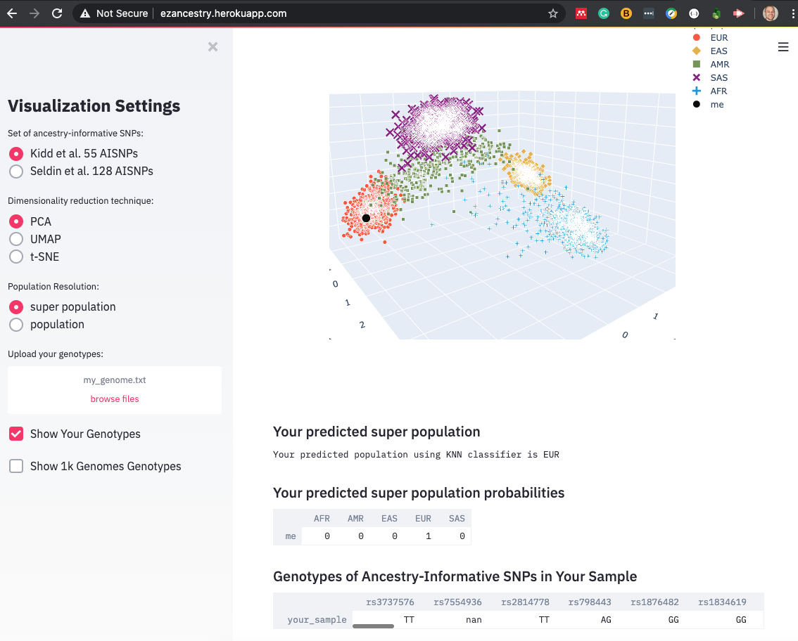

# ezancestry
One Thousand Genomes Project -- Population Visualizations using Streamlit

`ezancestry` is an interactive visualization app built in Python with [Streamlit](https://www.streamlit.io/) and deployed on [Heroku](https://heroku.com).

Visualize you genotypes at [http://ezancestry.herokuapp.com/](http://ezancestry.herokuapp.com/)



## Local Installation and Usage

`ezancestry` can be installed locally:

1. Download `ezancestry`

2. Change into the `ezancestry` directory:
    ```
    $ cd ezancestry
    ```

3. Create a [virtual environment](https://docs.python.org/3/library/venv.html):
    ```
    $ python -m venv .venv
    ```

4. Activate the virtual environment:
    ```
    $ source .venv/bin/activate
    ```

5. Install required packages:
    ```
    (.venv) $ pip install -r requirements.txt
    ```
    If issues installing [cyvcf2](https://github.com/brentp/cyvcf2), see
    [here](https://github.com/brentp/cyvcf2/issues/107). Setting these environment variables
    might work (if `openssl` installed with [MacPorts](https://www.macports.org)):
    
    ```
    export LDFLAGS="-L/opt/local/include"
    export PKG_CONFIG_PATH="/opt/local/include"
    export CPPFLAGS="-I/opt/local/include"
    ```

6. Run `ezancestry`:
    ```
    (.venv) $ streamlit run app.py
    ```
    You will then be presented with a URL to use the app in a browser.
    
7. Ctrl-C to stop the web server

8. Deactivate the virtual environment:
    ```
    (.venv) $ deactivate
    ```


## Run ezancestry on openSNP data!
Thanks to [Andrew Riha](https://github.com/apriha), it's easy to predict the ancestries for all of the [openSNP](https://opensnp.org/) samples:
1. Download the [data](https://opensnp.org/data/zip/opensnp_datadump.current.zip) to the `data` directory. It's a large zipped directory!
2. Follow steps 1-5 above.
3. Run `python opensnp_ancestry.py` and wait for the results.